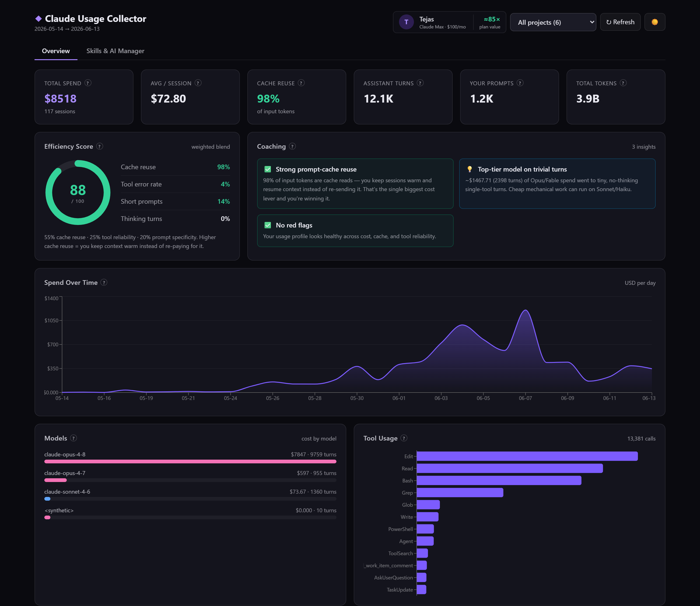
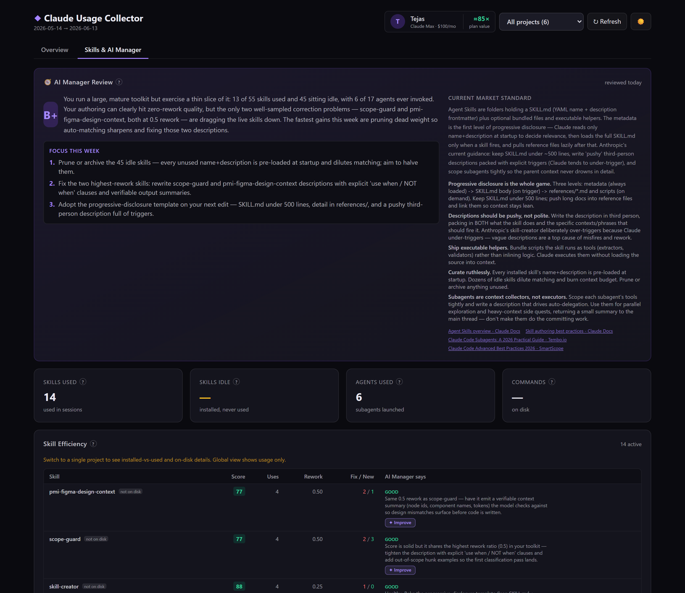
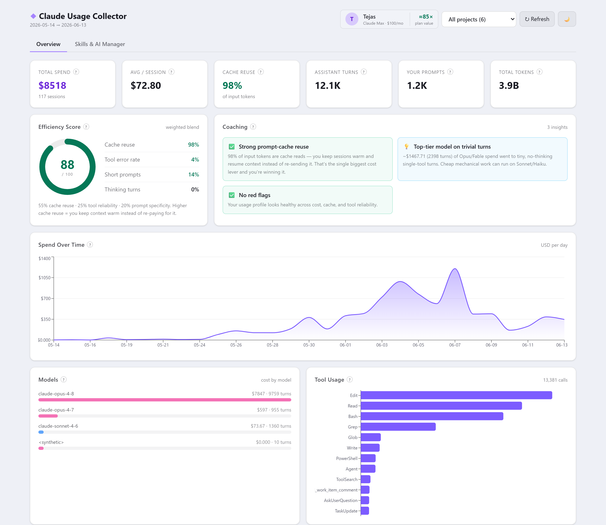

# Claude Usage Collector

> A local, privacy-first analytics dashboard for your **Claude Code** usage — cost, efficiency, and an
> "AI manager" that scores your skills and tells you how to improve.

Claude Code already writes a detailed transcript of every session to `~/.claude/projects`. This tool
reads those transcripts and turns them into answers to two questions:

1. **How efficiently am I using Claude?** — a transparent 0–100 score you can actually defend.
2. **How do I get better (and cheaper)?** — concrete, data-driven coaching from your own behavior.

Everything runs on your machine. **No API keys, no telemetry, nothing leaves your computer.**



---

## Highlights

- 📊 **Cost & token analytics** — estimated spend over time, by model, by project, with cache-efficiency
  breakdown. (Estimates are API-equivalent value — see [Cost is an estimate](#cost-is-an-estimate).)
- 🎯 **Efficiency score** — a transparent blend of cache reuse, tool reliability, and prompt specificity.
- 🧰 **Skills & agents intelligence** — what's installed vs. what you actually use, with a per-skill
  efficiency score derived from how often the turns *after* a skill ran were corrections vs. enhancements.
- 🧭 **AI Manager review** — a periodic review (overall grade, weekly focus, per-skill upgrade prompts)
  benchmarked against current Anthropic skill-authoring guidance.
- 🔎 **Session explorer** — searchable, sortable table of every session.
- 🌗 **Light & dark themes**, 🖥️ **runs as an always-on local service**, and a one-click **✦ Improve**
  button that hands you a ready-to-paste prompt to fix any weak skill.

> **Privacy:** the dashboard only reads local transcript files and serves them to `localhost`. It never
> makes outbound network calls (the optional AI-Manager refresh runs your local `claude` CLI).

---

## Screenshots

**Skills & AI Manager** — toolkit inventory, per-skill efficiency scores, and the AI-manager review with
one-click *Improve* prompts:



**Light theme:**



---

## Quick start

### Prerequisites
- [Node.js](https://nodejs.org) 18+ on your `PATH` (`node -v`)
- You've used Claude Code at least once (so `~/.claude/projects` contains transcripts)
- Windows is required for the auto-start service scripts; dev mode works on any OS

### Install & run

```bash
git clone <your-repo-url> usage-collector
cd usage-collector
npm install
cp usage-collector.config.example.json usage-collector.config.json   # then edit name/plan
npm run build
```

Then choose how to run it:

| Mode | Command | URL |
|---|---|---|
| **Always-on service** (Windows, recommended) | double-click `scripts\install-service.cmd` | http://localhost:47600 |
| **Dev / hot reload** | `npm run dev` | http://localhost:5173 |

The service builds once and auto-starts hidden at every logon. After changing code, run
`scripts\restart.cmd` to rebuild + restart. Data refreshes live via the **↻ Refresh** button — only
code changes need a rebuild.

---

## Configuration

| File / Var | Purpose | Default |
|---|---|---|
| `usage-collector.config.json` | Identity card: `name`, `email`, `plan`, `planPriceUsd` | auto-seeded from OS username |
| `CLAUDE_PROJECTS_DIR` (env) | Where to read transcripts from | `~/.claude/projects` |
| `PORT` (env / `scripts\serve.cmd`) | Server port | `47600` (service) / `5174` (dev API) |

`usage-collector.config.json` and `ai-manager-review.json` are per-user and git-ignored.

---

## How it works

```
~/.claude/projects/<encoded-cwd>/*.jsonl
   │  server/src/parser.ts   parse + dedup (cost per message, content per tool-call id)
   ▼
server/src/{metrics,toolkit}.ts   aggregate → overview / sessions / skills / coaching
   │  server/src/store.ts          mtime-keyed cache (re-parses only changed folders)
   ▼  Express API + static SPA (server/src/index.ts) — one process, one port
   ▼  React + Recharts (web/)
```

- **Stack:** Node + Express + TypeScript (server), React 19 + Vite + Tailwind v4 + Recharts (web).
- **One process in production:** when a `dist/` build exists, the Express server serves both the API and
  the UI, so there's no separate dev server to run.

### Cost is an estimate

Transcripts log token counts, not dollars. Costs are computed from public per-token rates in
`server/src/pricing.ts` (cache reads at the cache-read rate; cache writes at 1.25×/2× input; unknown
models fall back to Opus-tier and are flagged). **If you're on a flat subscription, this is the
API-equivalent *value* of your usage, not your bill** — the dashboard surfaces it as an ROI multiple.

Assistant records are de-duplicated by `message.id` for cost (Claude Code re-logs on resume) and by each
`tool_use` id for content, so tool/skill counts stay accurate even across re-logged, multi-part messages.

### Skill efficiency score

For each skill invocation, the next few prompts are classified as **corrections** (the skill's output
needed fixing → counts against it) or **enhancements** (a new request → explicitly *not* counted). The
score is `100 − (rework_ratio / 1.5) × 70`. It's a **keyword heuristic** — a signal to investigate, not a
verdict — and low-sample skills are flagged.

### AI Manager review

Skill *judgment* (market-standard scoring + upgrade recommendations) can't be produced by a static server,
so it's generated out-of-band by Claude Code into `ai-manager-review.json`; the dashboard renders it and
flags staleness. To refresh it daily, schedule `scripts\refresh-review.cmd` (Windows Task Scheduler):

```
schtasks /Create /TN "Claude Usage - AI Manager Review" /SC DAILY /ST 11:30 ^
  /TR "%CD%\scripts\refresh-review.cmd" /F
```

---

## Background service (Windows)

| Script | Action |
|---|---|
| `scripts\install-service.cmd` | Wire auto-start (Startup folder) to this clone and start it |
| `scripts\uninstall-service.cmd` | Remove auto-start and stop the service |
| `scripts\restart.cmd` | Rebuild the UI and restart |
| `scripts\stop.cmd` | Stop the running service |

Logs: `scripts\service.log`. The scripts are path-independent (they resolve the repo from their own
location and use `node`/`claude` from `PATH`), so the clone can live anywhere; only the port is hardcoded
in `scripts\serve.cmd`.

> **Why not IIS?** Hosting Node in IIS needs the unmaintained `iisnode` shim. The Startup-folder launcher
> runs your real Node server with zero extra dependencies and no admin rights. For a true Windows Service
> that runs before login, wrap `scripts\serve.cmd` with [NSSM](https://nssm.cc).

---

## Roadmap ideas

- Per-session drill-down (prompt → response → cost timeline)
- Prompt-quality analysis (length vs. turns-to-resolution)
- Export to CSV / shareable snapshot
- Cross-platform auto-start (launchd / systemd)

## Contributing

Issues and PRs welcome. Keep changes typed and run `npm run build` before submitting.

## License

[MIT](LICENSE)

---

*Independent, unofficial tool. Not affiliated with or endorsed by Anthropic. "Claude" is a trademark of
Anthropic. Cost figures are estimates and skill scores are heuristic signals.*
